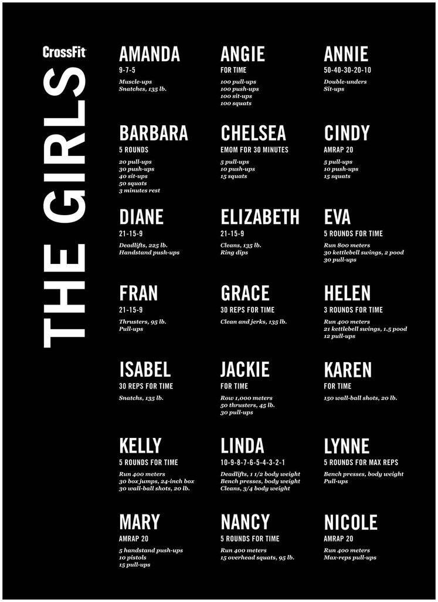

# **The Crossfit Girls poster comes to life!**

This is actually my first project as I begin my path to becoming a Full Stack developer. Next week I'll start my 3-Year apprenticeship in Web and Mobile development but I've been doing courses in Udemy since March of this year.

## **The project**

I'm a Crossfit addict and this idea's been in my head for a long time now and finally I decided to make it come to life.
At first it was a simple idea but with time and learning I want it to be a big project (not only the poster written in code).
For example, I would like to add maybe other girl WOD that are not in the original poster, adding tips and tricks for each WOD, creating a global leaderboard and many more that will come to my mind. So it's not going to be that simple :stuck_out_tongue_winking_eye:

Things I'd like to do:

-   Add tips and tricks for every WOD in every wod page.
-   Add a button/switch to change from lb/pood to kg.
-   Add button to change from RX to a Scaled version of the poster
    -   Consider the possibility of adding just one Scaled level or two for more versatility.
-   Create a global leaderboard (will be a page apart, accessible through the navigation menu) (I have to figure out how).
    -   Possibility to create your own account to log the results.
    -   Possibility to check the WODs somehow (adding a checkbox or changing background color of the wod) to check them done.
    -   Possibility to export the WODs in PDF (or other formats) only when they're all completed.

### **For those who doesn't know which poster I'm talking about** :arrow_heading_down:

## 
